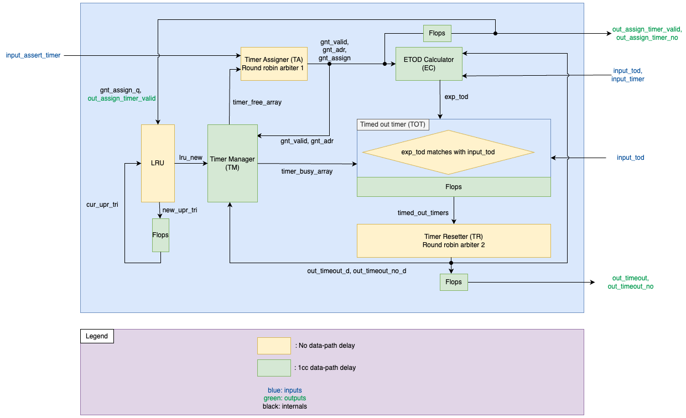
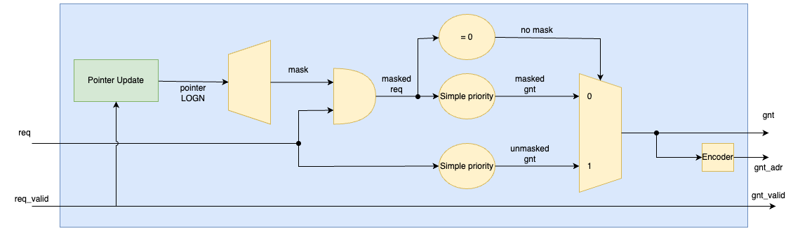
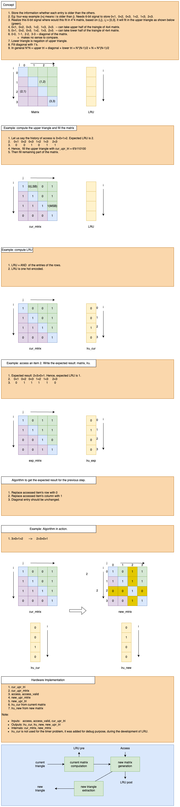
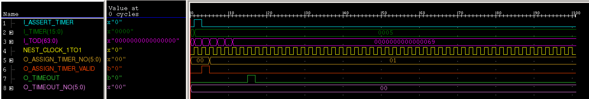
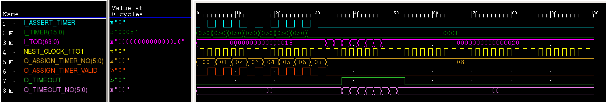
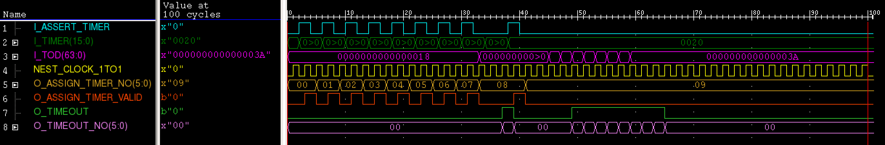
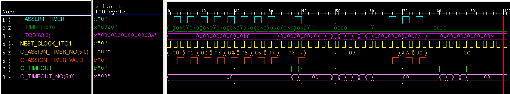
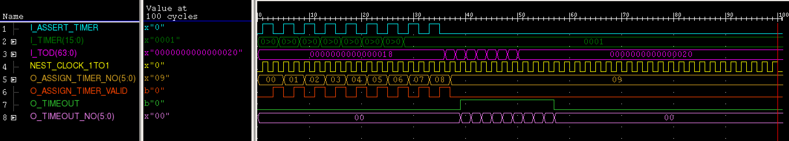
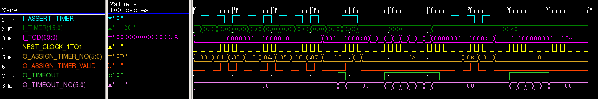
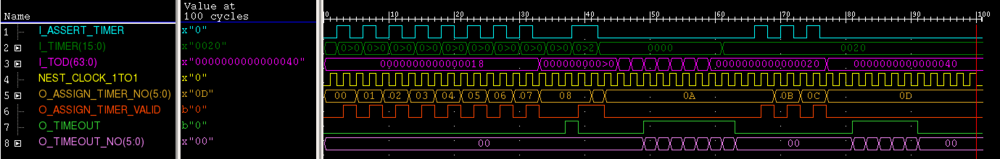

# 1 ChronoFlex Timer Scheduler

## 1.1 Introduction

**ChronoFlex Timer Scheduler** is a highly parameterized timer management system designed for embedded and high-performance software applications. It is an essential component in the processor design. It supports 64-bit timers, enabling precise and scalable timing operations for a wide range of use cases.
Key features include:
- **Fully Parameterized Design:** Easily configurable to suit diverse timing requirements.
- **64-bit Timer Support:** Enables management of very large timer values for long-duration or high-precision tasks.
- **Simultaneous Time-out Handling:** Efficiently processes multiple timer expirations across consecutive clock cycles.
- **Timer-value Replacement:** Dynamically replaces timer values when all timers are busy, ensuring uninterrupted operation.
- Support for maximum N (=64) timers


## 1.2 Design Interface Description

| S.No | Signal Name               | Port Direction | Bit Width        | Description                                                                 |
|------|---------------------------|----------------|------------------|-----------------------------------------------------------------------------|
| 1    | I_ASSERT_TIMER            | IN             | 1                | It is used to request for a timer                                           |
| 2    | I_TIMER                   | IN             | 16               | It is used to program the timer, if a timer is assigned to the user        |
| 3    | I_TOD                     | IN             | 64               | It is the input Time Of Day (TOD) that increments randomly                 |
| 4    | O_ASSIGN_TIMER_NO         | OUT            | ⌈Log2(N)⌉       | It is the address of the timer that is assigned to the user                |
| 5    | O_ASSIGN_TIMER_VALID     | OUT            | 1                | It is used to indicate if a timer is assigned to the user. If this signal is HIGH, then the value of O_ASSIGN_TIMER_NO is valid |
| 6    | O_TIMEOUT                 | OUT            | 1                | It is an interrupt signal that is used to indicate if any timer has timed-out |
| 7    | O_TIMEOUT_NO              | OUT            | ⌈Log2(N)⌉       | It is the address of the timer that timed-out                              |


**What it does**:
- When the input time (`I_TOD`) reaches a specific value, the timer generates an interrupt.
- Example: If `I_TOD` is **100** and the timer duration (`I_TIMER`) is **20**, an interrupt triggers when `I_TOD` becomes **120**.

**Key Outputs**:
1. `O_TIMEOUT`: Goes high for 1 clock cycle when any timer expires.
2. `O_ASSIGN_TIMER_NO`: Shows which timer caused the interrupt.
    - Example: If timer 7 (out of 64) times out, `O_ASSIGN_TIMER_NO` becomes `000111` (binary for 7).

**Design Requirements**:
- Support **64 timers** (`n=64`).
- If all timers are busy, replace the oldest assigned timer with the new `I_TIMER` value.

## 1.3 Architecture
1. Timer Assigner (TA): If the timer is available, it is selected or assigned in a round-robin manner.
2. Expected TOD Calculater (EC): calculates the expected time of day (tod), indicating when the timer should expire. Resets to 0, in case of timeout.
3. Timed Out Timer (TOT) checks if the timers have expired based on the current time of day (tod) and the timer's status. If a timer is active and has timed out, it marks it as such. If the timer is not busy, TOT resets the status.
4. Timer Restter(TR) selects a timed-out timer, and if there are multiple, it chooses one in a round-robin manner.
5. Timer Manager (TM) marks the timer as busy and then resets it. It sets the timer based on the grant valid signal and grant address from the Timer Assigner, and resets it based on the timeout signal and timeout number from the Timer Resetter.
6. Least Recently Used (LRU) unit tracks the history internally whenever a timer is asserted, and gives the least recently used timer number.


### 1.3.1 Timer Assigner (TA)

**Role**: Assigns timers to incoming requests when slots are available.  
**Key Features**:
- **Round-Robin Selection**: Ensures fair distribution of timer assignments across available slots.
- **Busy-State Handling**: Skips timers marked as "busy" during assignment.
- **Grant Signals**: Outputs a "grant valid" signal and "grant address" to confirm assignment.

**Workflow**:
1. Checks for available timers (not busy).
2. Selects the next free timer in round-robin order.
3. Sends grant signals to the Timer Manager (TM) to mark the timer as busy.

**Example**:  
If timers 1 and 3 are busy, TA assigns the next request to timer 2 (if free), then cycles back to timer 0.
### 1.3.2 Expected TOD Calculator (EC)

**Role**: Computes the expiration time for each timer.  
**Key Features**:
- **64-bit Time-of-Day (TOD) Support**: Handles large timer values.
- **Reset-on-Timeout**: Clears the expected TOD to `0` once the timer expires.

**Workflow**:
1. Receives the current TOD and timer value (e.g., "100 ms").
2. Calculates: `Expected TOD = Current TOD + Timer Value`.
3. Resets to `0` when the timer times out.

**Example**:  
If the current TOD is `5000 ms` and the timer is set for `100 ms`, the expected TOD becomes `5100 ms`.

### 1.3.3 Timed-Out Timer Checker (TOT)

**Role**: Identifies expired timers and updates their status.  
**Key Features**:
- **Real-Time Comparison**: Compares current TOD with expected TOD.
- **Status Management**: Marks timers as "timed out" or resets them if inactive.

**Workflow**:
1. For each timer, checks if `Current TOD ≥ Expected TOD`.
2. If true and the timer is active:
    - Marks it as "timed out."
3. If the timer is inactive:
    - Resets its status to avoid false triggers.

**Example**:  
At TOD `5100 ms`, a timer with an expected TOD of `5100 ms` is marked as expired.


### 1.3.4 Timer Resetter (TR)

**Role**: Resets expired timers and frees up slots.  
**Key Features**:
- **Round-Robin Prioritization**: Selects timers to reset in a cyclic order.
- **Multi-Timeout Handling**: Processes multiple expired timers over consecutive cycles.

**Workflow**:
1. Scans for timers marked as "timed out."
2. Selects the oldest expired timer (round-robin).
3. Sends a "timeout signal" and "timeout number" to the Timer Manager (TM).

**Example**:  
If timers 2 and 4 expire simultaneously, TR resets timer 2 first, then timer 4 in the next cycle.

### 1.3.5 Timer Manager (TM)

**Role**: Manages timer states (busy/free) and coordinates assignments/resets.  
**Key Features**:
- **State Machine Logic**: Tracks timer status (active, busy, expired).
- **Signal Integration**: Responds to TA (grant signals) and TR (reset signals).

**Workflow**:
1. Marks timers as **busy** when TA assigns them.
2. Marks timers as **free** after TR resets them.
3. Updates timer values based on EC calculations.

**Example**:  
When TA assigns timer 3, TM sets it to `busy`. After TR resets it, TM sets it back to `free`.

### 1.3.6 Least Recently Used (LRU) Unit

**Role**: Tracks timer usage to optimize replacements.  
**Key Features**:
- **Usage History**: Maintains a log of timer accesses.
- **Replacement Policy**: Selects the least recently used timer when all slots are busy.

**Workflow**:
1. Records the timer number every time it’s assigned or reset.
2. When replacements are needed, selects the timer with the oldest access timestamp.

**Example**:  
If timers 0, 1, and 2 are busy, and timer 1 was used least recently, LRU selects timer 1 for replacement.


### 1.3.7 System Interaction

|Component|Key Responsibility|Interaction Partners|
|---|---|---|
|Timer Assigner (TA)|Assigns timers fairly|TM, LRU|
|Expected TOD (EC)|Computes expiration times|TOT|
|Timed-Out Timer (TOT)|Flags expired timers|TR|
|Timer Resetter (TR)|Resets expired timers|TM, TOT|
|Timer Manager (TM)|Manages timer states|TA, TR, EC|
|LRU Unit|Optimizes timer replacement|TA|


## 1.4 Micro Architecture and RTL Code

### 1.4.1 Round Robin Arbiter

A round-robin arbiter used to assign timers in a fair and sequential manner. The implementation is as follows:
- Pointer update
```vhdl
pointer_d <=  (pointer_q + "1") when req_valid = '1'  else (pointer_q);
pointer_q@free := [pointer_d];
```

- One priority arbiter receives the entire request signal.
- The other priority arbiter recieves masked out requests that come before the one selected by the round-robin pointer.
- Mask and Masked requests
```vhdl
mask      <= (N-1 downto 0 => '1') sll (to_integer(pointer_q));
masked_req  <= req and mask;
```

-- Final grant selection (mux)
```vhdl
gnt <= unmasked_gnt when (masked_req = (masked_req'range => '0')) else masked_gnt;
```




### 1.4.2 Simple Priority Arbiter
- A bit in the grant signal will be active if its corresponding request signal is active, and there are no higher priority requests.

```vhdl
higher_priority_reqs (0)            <= '0';
higher_priority_reqs (N-1 downto 1) <= req(N-2 downto 0) or higher_priority_reqs (N-2 downto 0);
gnt(N-1 downto 0)                   <= req(N-1 downto 0) and (not(higher_priority_reqs (N-1 downto 0)));
```


### 1.4.3 LRU unit



- current matrix computation: Fill the cur_mtrix with cur_upr_tri signal. 
```vhdl 
gen_rows_1: for i in 0 to N-1 generate
	gen_cols_1: for j in 0 to N-1 generate
				cur_mtrix(i)(j) <= 	cur_upr_tri( abs(((N*(N-1))/2) - (((N-i)*(N-i-1))/2)   + j-i-1)) when (i<j) else
									(not cur_upr_tri( abs(((N*(N-1))/2) - (((N-j)*(N-j-1))/2)   + i-j-1))) when (i>j) else 
									'1';
	end generate gen_cols_1;
end generate gen_rows_1;
```
- new matrix generation: If any entry is accessed make fill its row with 0, column with 1. Diagonal is unchanged.
```vhdl
gen_rows_2: for i in 0 to N-1 generate
	gen_row_i: for j in 0 to N-1 generate
			new_mtrix(i)(j) <= 	'0' when ((acc(i) = '1') and (i/=j) and (acc_valid='1'))else
								'1' when ((acc(j) = '1') and (i/=j) and (acc_valid='1')) else
								cur_mtrix(i)(j);
	end generate gen_row_i;
end generate gen_rows_2;
```
- Updated triangle extraction: Extract new_upr_tri from new_mtrix
```vhdl
gen_rows_3: for i in 0 to N-2 generate
	gen_cols_3: for j in i+1 to N-1 generate
				new_upr_tri(( ((N*(N-1))/2) - (((N-i)*(N-i-1))/2)   + j-i-1)) <= new_mtrix(i)(j);										
	end generate gen_cols_3;
end generate gen_rows_3;
```

- Compute LRUs
```vhdl
gen_rows_4: for i in 0 to N-1 generate
	lru_cur(i) 		<= and_reduce(cur_mtrix(i));
	lru_new(i) 	<= and_reduce(new_mtrix(i));
end generate gen_rows_4;
```

##### 1.4.3.1 Additional Logic in Timer Module
- Timed Out Timer: TOT checks if the timers have expired based on the current time of day (tod) and the timer's status. If a timer is active and has timed out, it marks it as such. If the timer is not busy, TOT resets the status.
```vhdl
TIMED_OUT_TIMER: for i in N-1 downto 0 generate
  timed_out_timers_d (i) <= '1' when ((timer_busy_array(i)='1') and (exp_tod(i)=i_tod))  else 
                            '0' when (timer_busy_array(i)='0') else 
                            (timed_out_timers(i));
end generate TIMED_OUT_TIMER;
```

- Timer Manager marks the timer as busy and then resets it. It sets the timer based on the grant valid signal and grant address from the Timer Assigner, and resets it based on the timeout signal and timeout number from the Timer Resetter.
```vhdl
TIMER_MANAGER: for i in N-1 downto 0 generate
  timer_busy_array_d (i)      <=  '1'   when ((gnt_valid='1')  and (i=tconv(gnt_adr)))   else
                                  '0'   when ((o_timeout_d='1') and (i=tconv(o_timeout_no_d)))  else
                                  timer_busy_array(i);
end generate TIMER_MANAGER;
```
## 1.5 Verification
#### 1.5.1 Testcases

| S.No   		|Testcase Name    | Description     | Feature Tested     |
|--------------|--------------|--------------|--------------|
| 1            | S1              |   1 timer set and timeout            |     A timer Assignment and a timeout.        |
| 2            | S2              |   8 timer set and timeout            |     All timer assignments and timeouts.         |
| 3            | S3              |   8 timers set; 1 timeout; 1 timer set; 8 timeout            |  Timer assignment after 1 timeout.            |
| 4            | S4              |   8 timers set; 1 timeout; 1 timer set; 7 timeout; 3 timer set; 4 timeout            |  Simultaneous timeouts            |
| 5            | S5              |   8 timer set; 1timer set(replace); 8 timeout            |   Replace the LRU timer.           |
| 6            | S6              |   8 timers set; 6th timeout; 6th set; 0th set (replace); timeout in this fashion (7, 5, 4, 3, 1, 2); set (2, 3, 4); timeout (simultaneous: 0, 2, 3,4,6)            |   Replace  the LRU and simulatneous output          |
| 7            | S7              |    8 timers set; 0th timeout; 0th set; 1s set (replace); timeout in this fashion (7, 5, 4, 3, 2); set (2, 3, 4); timeout (simultaneous: 0, 1,2 3,4)|   Replace  the LRU and simulatneous output           |

#### 1.5.2 Waveforms

1. The waveform of testcase s1: (1 timer set and timeout, A timer Assignment and a timeout) 
2. The waveform of testcase s2: (8 timer set and timeout, All timer assignments and timeouts) 
3. The waveform of testcase s3: (8 timers set; 1 timeout; 1 timer set; 8 timeout, Timer assignment after 1 timeout) 
4. The waveform of testcase s4: (8 timers set; 1 timeout; 1 timer set; 7 timeout; 3 timer set; 4 timeout, Simultaneous timeouts) 
5. The waveform of testcase s5: (8 timer set; 1 timer set (replace); 8 timeout, Replace the LRU timer) 
6. The waveform of testcase s6: (8 timers set; 6th timeout; 6th set; 0th set (replace); timeout in this fashion (7, 5, 4, 3, 1, 2); set (2, 3, 4); timeout (simultaneous: 0, 2, 3, 4, 6), Replace the LRU and simultaneous output) 
7. The waveform of testcase s7: (8 timers set; 0th timeout; 0th set; 1st set (replace); timeout in this fashion (7, 5, 4, 3, 2); set (2, 3, 4); timeout (simultaneous: 0, 1, 2, 3, 4), Replace the LRU and simultaneous output) 


For full source code, contact me at [LinkedIn](https://www.linkedin.com/in/ayazullakhan/) or [email](ak.ayazulla@gmail.com).


